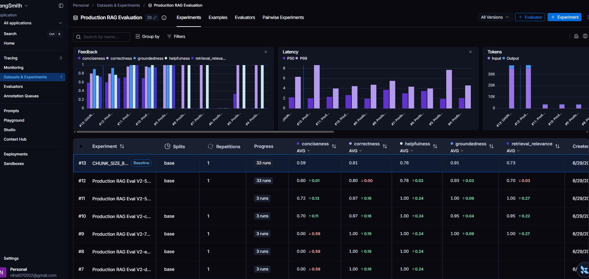

# Production-Grade RAG System for Technical Knowledge Retrieval

A production-oriented Retrieval-Augmented Generation (RAG) application designed to provide accurate, source-grounded answers from technical documents using Large Language Models, semantic search, and modern MLOps practices.

The system combines vector search, LLM-powered generation, observability, caching, security controls, and API engineering principles to deliver reliable and scalable question-answering capabilities.

---

## Overview

Traditional LLMs are limited by static training data and may generate hallucinated responses when asked about domain-specific documents.

This project addresses that challenge using Retrieval-Augmented Generation (RAG), where relevant document chunks are retrieved from a vector database and supplied to the language model as context before generating a response.

The application exposes a production-ready REST API built with FastAPI and includes observability, security, caching, and operational features commonly found in real-world AI systems.

---

## Key Features

### Retrieval-Augmented Generation (RAG)

* PDF document ingestion
* Intelligent document chunking
* Semantic embedding generation
* Vector storage using Pinecone
* Similarity-based retrieval
* Context-aware answer generation
* Source-grounded responses

### Production API Features

* FastAPI-based REST API
* Request validation with Pydantic
* Health monitoring endpoint
* Structured logging
* Error handling
* Source attribution

### Security Features

* Prompt injection detection
* Input validation
* Personally Identifiable Information (PII) detection
* Automatic PII anonymization
* API rate limiting

### Performance Optimizations

* Redis response caching
* Reduced OpenAI API calls
* Lower latency for repeated queries

### Observability

* LangSmith tracing
* End-to-end request tracking
* Retrieval inspection
* Prompt monitoring
* LLM response monitoring

---

## System Architecture

```text
                        ┌─────────────────────┐
                        │      Client         │
                        └──────────┬──────────┘
                                   │
                                   ▼
                     ┌──────────────────────────┐
                     │        FastAPI API       │
                     └──────────┬───────────────┘
                                │
               ┌────────────────┼────────────────┐
               │                │                │
               ▼                ▼                ▼

     Prompt Injection      PII Detection    Rate Limiting
        Protection       & Anonymization

                                │
                                ▼

                      ┌──────────────────┐
                      │    Redis Cache   │
                      └────────┬─────────┘
                               │
                Cache Hit ─────┘
                               │
                               ▼
                      ┌──────────────────┐
                      │    Retriever     │
                      └────────┬─────────┘
                               │
                               ▼
                      ┌──────────────────┐
                      │     Pinecone     │
                      └────────┬─────────┘
                               │
                               ▼
                      Relevant Context
                               │
                               ▼
                      ┌──────────────────┐
                      │      OpenAI      │
                      └────────┬─────────┘
                               │
                               ▼
                     Grounded Response

Observability Layer
─────────────────────────────────
LangSmith Tracing
Structured Logging
```

---

## Technology Stack

## RAG EVALUATION
* Used langgraph for both observability and evaluation
* 

### AI / LLM

* OpenAI GPT-4.1 Mini
* LangChain

### Vector Database

* Pinecone

### Embeddings

* Sentence Transformers
* all-MiniLM-L6-v2

### Backend

* FastAPI
* Pydantic

### Security

* Presidio
* Custom Prompt Injection Filters

### Caching

* Redis

### Observability

* LangSmith
* Python Logging

### Deployment

* Docker
* Docker Compose
* AWS EC2 (Planned)
* AWS ECR (Planned)
* GitHub Actions (Planned)

---

## API Endpoints

### Ask Question

```http
POST /ask
```

Request

```json
{
    "question": "What is RMSE?"
}
```

Response

```json
{
    "answer": "RMSE is a metric used to measure prediction error...",
    "sources": [
        {
            "page": 59,
            "title": "Hands-On Machine Learning with Scikit-Learn and TensorFlow"
        }
    ]
}
```

---

### Health Check

```http
GET /health
```

Response

```json
{
    "status": "healthy"
}
```

---

## Caching Workflow

The system uses Redis to cache frequently requested responses.

```text
User Question
      │
      ▼
   Redis

Cache Hit?
 │
 ├── Yes
 │     │
 │     ▼
 │  Return Cached Answer
 │
 └── No
       │
       ▼
    Retrieve Context
       │
       ▼
      OpenAI
       │
       ▼
   Store In Redis
       │
       ▼
   Return Response
```

This significantly reduces:

* API costs
* Response latency
* Repeated retrieval operations

---

## Security Workflow

```text
Incoming Request
       │
       ▼

Prompt Injection Detection
       │
       ▼

PII Detection
       │
       ▼

PII Anonymization
       │
       ▼

Rate Limiting
       │
       ▼

RAG Pipeline
```

Examples of protected inputs:

* Prompt injection attempts
* Email addresses
* Phone numbers
* Sensitive user information

---

## Observability

The application uses LangSmith for tracing critical components:

* Retrieval operations
* Context generation
* LLM calls
* Redis cache operations
* PII processing
* End-to-end RAG execution

This enables rapid debugging and performance monitoring.


## 📊 RAG Evaluation & Observability

To ensure the reliability and quality of the Retrieval-Augmented Generation (RAG) system, an offline evaluation pipeline was implemented using **LangSmith** and **OpenEvals**.

Each experiment is automatically benchmarked against a curated evaluation dataset containing in-domain, multi-hop, out-of-scope, and adversarial queries. This enables objective comparison of different retrieval and prompting strategies before deployment.

### Evaluation Metrics

The following metrics are tracked for every experiment:

* ✅ **Correctness** – Measures factual correctness of the generated response against reference answers.
* ✅ **Groundedness** – Verifies that every generated claim is supported by the retrieved context.
* ✅ **Retrieval Relevance** – Evaluates whether the retriever returned the most relevant document chunks.
* ✅ **Helpfulness** – Measures how effectively the response satisfies the user's question.
* ✅ **Conciseness** – Evaluates whether answers are clear and appropriately concise.
* ✅ **Latency & Token Usage** – Tracks inference performance and API cost.

### Experiment Tracking

Different retrieval configurations (chunk size, retrieval strategy, Top-K, prompts, etc.) can be evaluated and compared side-by-side using LangSmith Experiments, making it easy to identify the highest-performing configuration before deployment.

### Evaluation Dashboard

<p align="center">
  
</p>

**Current Evaluation Summary**

| Metric              |    Score |
| ------------------- | -------: |
| Correctness         | **0.80** |
| Groundedness        | **0.93** |
| Retrieval Relevance | **0.9(shows less in the image due to out of context questions aslo being evaluated)** |
| Helpfulness         | **0.78** |
| Conciseness         | **0.60** |

> The evaluation dataset contains a mix of definition-based, comparison, multi-hop, out-of-scope, and prompt-injection queries to assess both retrieval quality and answer generation robustness.

---

## Running the Application

### Clone Repository

```bash
git clone <repository-url>
cd production-rag
```

### Configure Environment Variables

Create a `.env` file:

```env
OPENAI_API_KEY=YOUR_KEY
PINECONE_API_KEY=YOUR_KEY

LANGCHAIN_API_KEY=YOUR_KEY
LANGCHAIN_TRACING_V2=true
LANGCHAIN_PROJECT=production-rag
```

### Run with Docker

```bash
docker compose up --build
```

### Access API Documentation

```text
http://localhost:8000/docs
```

---

## Future Enhancements

* Hybrid Search (BM25 + Vector Search)
* RAG Evaluation using Ragas
* CI/CD Pipeline with GitHub Actions
* AWS ECR Integration
* AWS EC2 Deployment
* Monitoring Dashboard
* Automated Testing Suite

---

## Skills Demonstrated

* Retrieval-Augmented Generation (RAG)
* Large Language Models (LLMs)
* Vector Databases
* Semantic Search
* API Development
* Caching Systems
* AI Security
* Observability & Monitoring
* Docker & Containerization
* Production AI System Design

---

## Author

### Nihal Siddiqui

Aspiring Data Scientist | Machine Learning Engineer | Generative AI Enthusiast

Focused on building production-grade AI applications using modern MLOps and LLM engineering practices.
