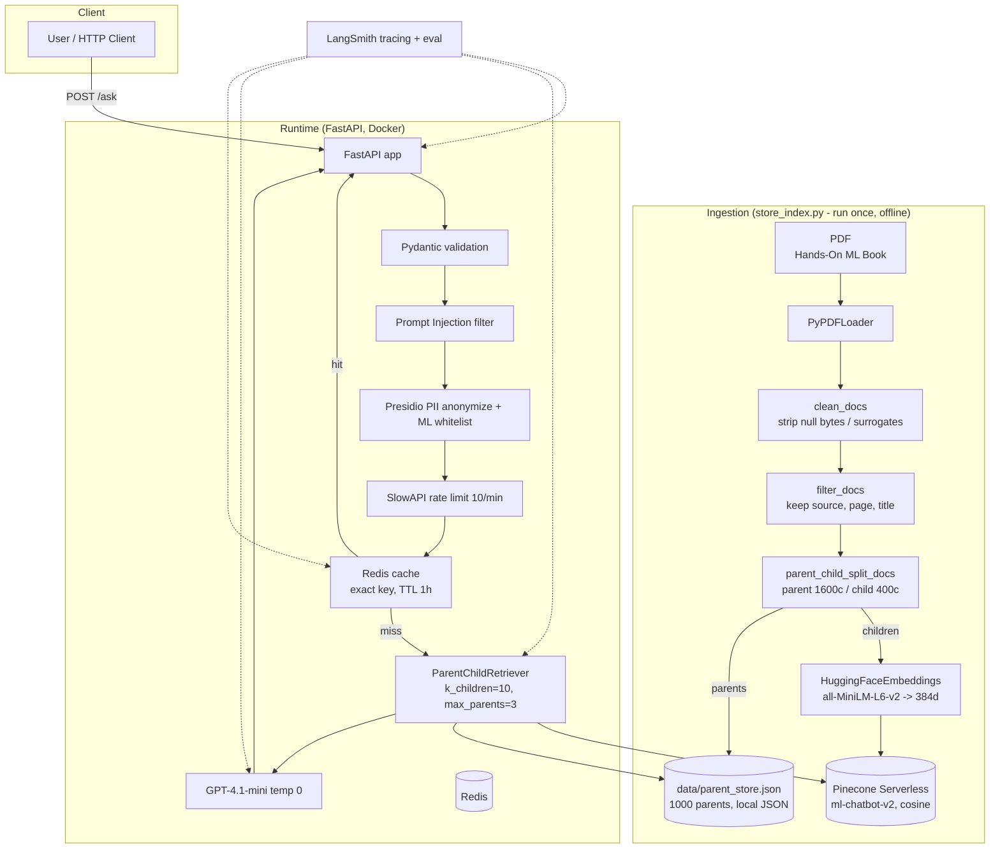

# Interview Study Plan — `production-rag`

> **Project:** Production-Grade RAG System for Technical Knowledge Retrieval
> **Repo:** `production-rag` (branch `updates` is the latest feature work)
> **Author:** Nihal Siddiqui
> **Target role:** AI Engineer (internship)

---

## 1. PROJECT OVERVIEW

### Elevator Pitch (memorize this, ~40 seconds)

"I built a production-oriented Retrieval-Augmented Generation (RAG) API that answers technical questions from a 564-page machine-learning textbook. The problem it solves is LLM hallucination on domain-specific content: a vanilla LLM trained on general data either doesn't know the material or makes things up. My system ingests the PDF, cleans and chunks it using a **parent-child chunking strategy** (small 'child' chunks get embedded and searched for retrieval precision; large 'parent' chunks get sent to the LLM for context richness), embeds the children with a local Sentence-Transformer model, stores them in a **serverless Pinecone vector index**, and at query time retrieves the top parents and feeds them to **GPT-4.1-mini** with a grounding prompt. On top of that I built the production wrapper: a FastAPI service with input validation, a prompt-injection filter, Presidio-based PII anonymization tuned for ML jargon, IP rate limiting, Redis response caching, LangSmith tracing, Docker Compose, CI/CD to AWS ECR, and an evaluation harness with LLM-as-a-judge plus Ragas metrics."

### 5 TL;DR Bullets

1. **RAG pipeline:** Ingestion (PDF → clean → filter → parent-child chunks) → embedding (all-MiniLM-L6-v2, 384-dim) → Pinecone (cosine, serverless, `ml-chatbot-v2`) → custom `ParentChildRetriever` (search 10 children, dedupe by `parent_id`, return up to 3 parents) → GPT-4.1-mini (`temperature=0`) with a grounded "answer only from context" prompt.
2. **Production API:** FastAPI `POST /ask` + `GET /health` with Pydantic validation, injection filter, PII anonymization, rate limiting (10/min/IP), Redis exact-match caching (TTL 1 hour), structured logging.
3. **Observability & evaluation:** LangSmith `@traceable` tracing on every stage; a 30-question LangSmith dataset (including out-of-domain and injection-attempt negatives); 5 LLM-as-judge metrics (correctness, conciseness, helpfulness, groundedness, retrieval relevance) plus Ragas (faithfulness, answer relevancy, context precision/recall).
4. **Deployment:** Docker + Docker Compose (app + Redis), GitHub Actions CI that validates `docker compose build`, and CD that pushes the image to AWS ECR on the `deploy` branch.
5. **Key engineering highlights:** custom parent-child retriever implementing the LangChain interface, a domain-aware PII whitelist that fixes NER false positives (e.g., "Adam optimizer" → not `<PERSON>`), and a defense-in-depth request path.

---

## 2. ARCHITECTURE DEEP-DIVE

### System Diagram



### Request data flow (what happens when a user calls `/ask`)

1. `POST /ask` → FastAPI runs `ask()` in `src/api/routes.py`.
2. Pydantic validates body against `QueryRequest` (question must be 3–1000 chars) → else automatic **422**.
3. `validate_prompt()` regex-scans for injection phrases → **400** if flagged.
4. `anonymize_pii()` runs Presidio NER, filters against the ML whitelist + high-risk entity list, replaces matches with `<ENTITY_TYPE>` placeholders.
5. Redis lookup with the **sanitized** question as the key → if hit, return cached response (**cache hit**).
6. On miss: `ask_question(sanitized)` → `ParentChildRetriever.invoke()` → Pinecone similarity search (top 10 children) → dedupe `parent_id` → look up top 3 parents from local JSON → join with `\n\n---\n\n` → format `RAG_PROMPT` → GPT-4.1-mini generate.
7. Result stored in Redis (`cache_answer`, `ex=3600`), returned as `QueryResponse {answer, sources[{page,title,parent_id}]}`.
8. Every step is wrapped in `@traceable` and appears as a LangSmith trace.

### Startup path

- **Local dev:** `uvicorn src.api.main:app --host 0.0.0.0 --port 8000` (or `fastapi dev` / `--reload`; watchfiles reload noise is visible in `logs/app.log`).
- **Docker:** `docker compose up --build` → builds `Dockerfile` (python:3.11-slim, installs `requirements.txt`, `CMD uvicorn src.api.main:app`), starts `app` + `redis:7-alpine`.
- **Critical import-time side effects:** importing `src.retriever` (pulled in by `src.rag_chain` → `src.api.routes`) executes `_load_parent_store()` at **module import time**. If `data/parent_store.json` is missing, the API **crashes on boot** (FileNotFoundError). Also `cache.py` connects to Redis at import and `pii.py` initializes Presidio engines at import (slow first boot).

### Key modules & responsibilities

| Module | Responsibility (2–3 sentences) |
|---|---|
| `store_index.py` | **Ingestion entry point.** Loads/cleans/filters the PDF, creates parent-child chunks, writes parents to `data/parent_store.json`, creates the Pinecone index if absent, and uploads child embeddings. Not part of the runtime container. |
| `src/helper.py` | **Ingestion utilities.** `doc_loader`, `clean_text` (strips `\x00`, surrogate range `\ud800-\udfff`, re-encodes UTF-8), `clean_docs`, `filter_docs` (keeps only `source`/`page`/`title` metadata), and `parent_child_split_docs` which implements two-level recursive splitting into a `ParentChildChunks(children, parents)` dataclass. `split_docs` and `get_parent_texts_from_children` are legacy/unused helpers. |
| `src/retriever.py` | **Custom retriever.** `ParentChildRetriever` wraps the Pinecone vectorstore: searches children (k=10), dedupes on `parent_id` preserving rank order, fetches up to `MAX_PARENTS=3` parent docs from the in-memory JSON store, and returns LangChain `Document`s. Implements `get_relevant_documents`/`invoke`/`ainvoke` so it is a drop-in LangChain retriever. Loads `parent_store.json` at import. |
| `src/prompt.py` | Single grounded `RAG_PROMPT`: "answer ONLY using the provided context; if not found say 'I don't know based on the provided documents.'" This is the hallucination guardrail. |
| `src/rag_chain.py` | **Generation pipeline.** `ask_question()` is the orchestration function: retrieve parents → join contexts → format prompt → `ChatOpenAI(gpt-4.1-mini, temperature=0)` → return `{question, contexts, answer, sources}`. Has leftover debug `print()` statements. |
| `src/api/main.py` | FastAPI app factory: registers the router, attaches `slowapi` `Limiter` to `app.state`, adds the `RateLimitExceeded` handler. |
| `src/api/routes.py` | **HTTP layer.** `GET /health`, `POST /ask`. Orders the pipeline (validation → injection → PII → cache → RAG) and wraps everything in a try/except that returns HTTP 500 with the raw exception string. |
| `src/api/schemas.py` | Pydantic v2 models: `QueryRequest` (3–1000 chars), `SourceInfo` (page/title/parent_id), `QueryResponse`. |
| `src/api/security.py` | Regex blacklist of injection phrases (e.g., "ignore previous instructions", "reveal system prompt"). Raises HTTP 400 on match. |
| `src/api/pii.py` | Presidio `AnalyzerEngine` + `AnonymizerEngine` (singletons). Filters NER hits against `ML_WHITELIST` (Adam, BERT, ReLU, ...) and a high-risk entity set; masks with `<ENTITY_TYPE>`. Also has `anonymize_pii_with_mapping()` (reversible) that is **not wired into the API**. |
| `src/api/cache.py` | Thin Redis wrapper. Key = sanitized question string; value = JSON of the full result; TTL 3600s. `decode_responses=True`. |
| `src/api/rate_limiter.py` | SlowAPI `Limiter(key_func=get_remote_address)` — IP-based limiting. |
| `src/api/logger.py` | Root logging config (`INFO`, stream handler, `rag-api` logger). |
| `src/evaluation/dataset.py` | Creates/reads the LangSmith dataset `"Production RAG Evaluation"` and uploads 30 Q&A examples from `questions.json`. |
| `src/evaluation/evaluator.py` | Wraps 5 openevals `create_llm_as_judge` evaluators (correctness, conciseness, helpfulness, groundedness, retrieval relevance) as LangSmith `@run_evaluator`s. |
| `src/evaluation/runevals.py` | `target()` runs the real `ask_question`; `evaluate()` runs all 5 judges over the dataset with `experiment_prefix="Parent_Child_RAG_Eval"`. |
| `src/evaluation/metrics.py` | Declares Ragas metrics: faithfulness, answer_relevancy, context_precision, context_recall. |
| `src/evaluation/questions.json` | 30 curated Q&A — 20 in-domain ML questions + negatives (out-of-domain "capital of France") + injection/instruction-violation probes. |
| `config.py` | Central chunk hyperparameters: parent 1600/340, child 400/85, legacy 800/170. |
| `tests/` | **Stale/legacy** scripts referencing a non-existent `app.ingestion.*` package (previous architecture). Do not run. |
| `.github/workflows/docker-build.yml` | CI: on push/PR to `deploy`, copies `.env.example → .env`, validates `docker compose config`, builds the stack. |
| `.github/workflows/deploy.yml` | CD: on push to `deploy`, AWS credential config → ECR login → `docker build` → tag → `docker push`. |

---

## 3. KEY DECISIONS & TRADEOFFS

Format per decision: **Decision → Alternatives → Why → Sacrifices/Downsides.**

| # | Decision | Alternatives | Why you chose it | Downsides / sacrifice |
|---|---|---|---|---|
| 1 | **Parent-child chunking** (parents 1600c/340o, children 400c/85o) | Flat chunking; sentence-aware splitters; document-aware splitters (e.g., by section); LlamaIndex hierarchical | Flat chunks cut through sentence/paragraph meaning — retrieved chunk may miss context just outside the window. Children give high-recall precise search; parents give the LLM coherent context. Same technique as production systems/LlamaIndex. | 2x storage and complexity; parent store must be hosted somewhere (here: local JSON); parent context can still cross section boundaries if parent size is too large; more hyperparameters to tune. |
| 2 | **all-MiniLM-L6-v2** (Sentence-Transformers, 384-dim, local, free) | OpenAI `text-embedding-3-small/large`; `bge`; `e5`; `gte` | Free, runs locally in Docker, no per-token API cost, fast, plenty good for sentence-level retrieval, well-supported by LangChain/Pinecone. | Older (2019) small model → weaker semantic fidelity vs. modern models; 384-dim limit; no multilingual strength; needs `torch` (~heavy image). Model/dimension is **locked** into the Pinecone index — swapping requires re-indexing. |
| 3 | **Pinecone Serverless** (AWS us-east-1, cosine, 384-dim) | Chroma (embedded), FAISS (local), Qdrant, Weaviate, pgvector, Milvus | Fully managed, zero-ops vector DB, scales out automatically, good LangChain integration, realistic for "production" claims. | Vendor lock-in + cost; network round-trip adds latency (vs in-process FAISS/Chroma); not self-hostable in the repo; no hybrid BM25 natively at time of build (you listed it as a future enhancement). |
| 4 | **GPT-4.1-mini, temperature=0** | GPT-4o; GPT-4o-mini; local LLM (Llama/Qwen via Ollama); Claude | Cheap, fast, strong instruction-following; `temperature=0` maximizes determinism for grounded retrieval answers and makes the LLM-as-judge evals stable. | Answers are not "creative"/conversational; still a hosted API (per-call cost, external dependency, no offline); if the model is deprecated the pipeline needs a code change. |
| 5 | **LangChain** | Raw OpenAI SDK; LlamaIndex; custom glue code | Gives standard abstractions (Document, retriever, `ChatOpenAI`, loaders, splitters, `PineconeVectorStore`) — rapid development and your `ParentChildRetriever` is a drop-in that still speaks the LangChain interface. | Indirection/version churn (note: `langchain-community` is being sunset); harder debugging; you're slightly coupled to its API surface. |
| 6 | **Regex blacklist for prompt injection** | LLM-based guard; fine-tuned classifier; transformer classifier (e.g., prompt-injection detectors); never use user text in a prompt | Zero-latency, zero-cost, deterministic, no extra model call. | **Trivially bypassable** (obfuscation, paraphrasing, case tricks, other languages). Only catches exact-ish phrases. It's a filter, not a defense. If you present this as "security", be ready to call it a *first layer* and propose an LLM guard as the next step. |
| 7 | **Presidio PII + domain whitelist** | LlamaGuard / custom NER; naive regex for emails/phones; skip PII handling entirely | Presidio is the de-facto open-source NER+anonymizer; the **ML whitelist** is the clever part — naive NER flags "Adam optimizer" as a PERSON and would break retrieval. Filtering to high-risk entity types reduces noise. | NER is imperfect (misses novel PII, flags weird stuff); slow-ish (~100ms+); the pipeline anonymizes the query but the **answer is generated from the anonymized text and never de-anonymized** (the mapping function exists but is unused) → the user sees `<PERSON>` in questions about people; no storage-level guarantee. |
| 8 | **Redis exact-match response cache (TTL 1h)** | Semantic (vector) cache; LRU on app memory; no cache | Cut repeated OpenAI calls and retrieval latency — big win for a chat API where the same question recurs; trivial to implement with `redis-py`. | Key is the **exact sanitized string** → tiny paraphrases miss; no normalization; stale answers for up to 1h if the index is updated; cached payload includes full contexts (memory). |
| 9 | **Parents stored in local `data/parent_store.json`, loaded at import** | Redis/S3/DB for parents; parent namespace in Pinecone; Parquet | Simplest possible implementation for ~1000 parents (≈1.7MB), fast in-memory lookups, zero infra. | **Not scalable** (whole file in RAM per worker, O(n) dict fine but memory doubles with corpus); single-node; **`.dockerignore` excludes `data/`** → the built image does NOT contain the store → container likely crashes at boot. This is the #1 thing to fix before calling it production. |
| 10 | **SlowAPI IP rate limit 10/min** | Token bucket per-user with auth; API-key quotas; Redis-backed sliding window | Simple, no auth infra, protects the OpenAI budget from runaway calls. | 10/min is very aggressive for real users; IP-based (NAT/proxies share IPs, abusers rotate IPs); **decorator ordering in `routes.py` likely means the limit is never enforced** (see Gotchas). No per-user differentiation without auth. |
| 11 | **LangSmith for tracing + evaluation** | Custom logging/metrics; Weights & Biases; MLflow | Free tier, native LangChain/LangGraph integration, tracing + dataset + `evaluate()` in one place, LLM-as-judge via `openevals`. | External dependency; **judge model == generator model** (gpt-4.1-mini judging gpt-4.1-mini) → biased/self-similar evaluation; dataset is only 30 hand-written examples. |
| 12 | **Ragas + LLM-as-judge evaluation** | Human eval; golden answer exact-match; ppl/rouge/bleu | LLM-judges measure the things that matter for RAG (groundedness, helpfulness, retrieval relevance); Ragas adds reference-based context quality. | Expensive to run repeatedly; noisy; both are proxy metrics — no end-to-end user study; `metrics.py` (Ragas) is declared but **not wired** into `runevals.py` (which only uses openevals judges). |
| 13 | **FastAPI (sync endpoints)** | Flask; Django; async FastAPI with `async def` + `httpx.AsyncClient` | FastAPI: pydantic validation, auto OpenAPI docs at `/docs`, modern ASGI. | Endpoints are sync → FastAPI runs them in a threadpool; every LLM/Pinecone/Redis call is blocking, so concurrent scaling is bounded by threadpool size; no `async/await` streaming of tokens. |
| 14 | **Docker Compose + GitHub Actions CI/CD to ECR** | Serverless (Lambda/CloudRun); managed RAG (AWS Bedrock KB); k8s; Vercel | Standard, learnable MLOps practice; CI validates compose, CD ships a container. | **No actual EC2/ECS deployment step exists** (ECR push only) — the "running in prod" story ends at a registry; no health checks on the container; no DB migrations; no secrets manager (uses `.env` file). |
| 15 | **RAG (retrieve-then-generate) instead of fine-tuning** | Fine-tune an LLM on the book; agents/tool-use; full-doc-in-context | RAG is dynamic (index can be updated without retraining), grounded (citations), cheap to start, and the textbook is the sole source of truth. Fine-tuning would bake the book into weights (stale, hallucination-prone, expensive). | RAG is only as good as retrieval — if a relevant chunk isn't retrieved, the model says "I don't know" (good) but the user gets nothing. Query understanding is limited (no query rewriting/multi-query, which you listed as future hybrid search). |
| 16 | **Metadata trimming (only source/page/title kept)** | Keep full PyPDF metadata (author, creation date, etc.) | Cuts Pinecone storage/meta overhead; only the fields you surface to users are needed. | You lose the ability to filter by author/date/section at query time; `page` values from PyPDF are sometimes floats (`59.0` in the notebook) → schema says `int`. |
| 17 | **No authentication on the API** | API-key/token auth; OAuth; per-tenant secrets | Not needed for a demo/interview artifact; keeps it simple. | Anyone who reaches the endpoint can burn your OpenAI budget (mitigated only by rate limiting); PII handling becomes less meaningful if anonymous. |

### Honest "gotchas" an interviewer could catch (know these cold)

1. **Rate limiting is probably dead code.** Decorator order in `routes.py:31-38` is:
   ```python
   @limiter.limit("10/minute")
   @router.post("/ask", response_model=QueryResponse)
   @traceable(name="full-pipeline")
   def ask(request, payload):
   ```
   Decorators apply bottom-up: `@traceable` runs first, then `@router.post` registers **that** function with the router and returns it, then `@limiter.limit` wraps it — but the router already captured the pre-limiter function. SlowAPI's recommended pattern is `@router.post` **outside** and `@limiter.limit` **inside**. **Verify by hitting `/ask` 11 times fast**; if no 429, the limit isn't enforced. Fix: swap order.
2. **Docker image excludes the parent store.** `.dockerignore` lists `data/` → `retriever.py` raises `FileNotFoundError` at import inside the container. The image as-is likely won't start. Fix: move parent store to a mounted volume / bake it in / move to Redis.
3. **Env var name mismatch.** `.env.example` uses `LANGCHAIN_API_KEY`/`LANGCHAIN_TRACING_V2`/`LANGCHAIN_PROJECT`, but the LangSmith SDK reads `LANGSMITH_API_KEY`/`LANGSMITH_TRACING`/`LANGSMITH_PROJECT` (which `rag_chain.py` actually prints). If you followed `.env.example`, tracing silently didn't activate. Be ready to explain what LangSmith actually needs.
4. **Error handling leaks internals.** `routes.py` returns `HTTPException(500, detail=str(e))` — internal exception text goes to the client. Prefer generic 500s + logged details.
5. **`/health` checks nothing.** It always returns `{"status":"healthy"}` even if Redis or Pinecone are down. A real health check should ping both.
6. **`store_index.py` hardcodes an absolute Windows path** to the PDF — not portable to CI/containers.
7. **Parent text still contains extraction artifacts** (e.g., mangled author names, null-byte-separated "Download from finelybook" fragments) — see `data/parent_store.json`. The `clean_text` regex doesn't fully repair UTF-16/mixed-encoding PDF text.
8. **`tests/` are broken/legacy** — they import `app.ingestion.*` which doesn't exist. There is **no runnable automated test suite** in the current architecture. If your resume claims testing, that's a gap (see §7).
9. **Evaluation self-judging:** generator and judge are both `gpt-4.1-mini`.

---

## 4. POTENTIAL INTERVIEW QUESTIONS + MODEL ANSWERS

> Say these out loud. The model answers are written in first person as you; adapt the phrasing to sound like you, not like a script.

### A. Walk me through / storytelling

**Q1. Walk me through this project (90 seconds).**
**A.** "The goal was to build a RAG system that answers questions from a machine-learning textbook without hallucinating. Ingestion side: I load the PDF, clean artifacts like null bytes, keep only useful metadata, then use **parent-child chunking** — children of ~400 chars are embedded and indexed, parents of ~1600 chars are kept as context. I embed children with `all-MiniLM-L6-v2`, a local 384-dim model, and store them in a serverless Pinecone index with cosine similarity. At query time a custom retriever searches 10 children, dedupes by parent id, and returns the 3 most relevant parents. Those go into a grounding prompt with GPT-4.1-mini at temperature zero. Around that I built a FastAPI service: Pydantic validation, a prompt-injection filter, Presidio PII anonymization with an ML-term whitelist so 'Adam optimizer' isn't masked as a person's name, IP rate limiting, Redis caching, and LangSmith tracing. I wrapped it in Docker Compose, added CI that validates the compose build, CD that pushes to ECR, and an evaluation harness with 30 curated questions and LLM-as-judge metrics."

**Q2. What does this project demonstrate, technically?**
**A.** "End-to-end production AI engineering: retrieval-augmented generation, custom retrieval logic, API design, security layers, caching, observability, evaluation, and containerized deployment. It's not just calling an LLM — the interesting engineering is the retrieval quality, the domain-aware PII handling, and the eval loop."

**Q3. Who would use this, and what's the impact?**
**A.** "A team that needs to answer questions from an internal technical corpus — e.g., engineers asking about a large ML textbook or company docs. Impact: grounded answers with page citations, drastically fewer hallucinations than raw LLM answers, and lower cost/latency for repeated questions thanks to Redis caching."

### B. Architecture

**Q4. Why did you separate the retriever into its own class instead of using `vectorstore.as_retriever()`?**
**A.** "The default retriever returns whatever it searched. With parent-child chunking, what I search (small children, high precision) is different from what I want to feed the LLM (large parents, rich context). So I wrote `ParentChildRetriever` that wraps the vectorstore, searches children, dedupes by `parent_id`, and returns parents. I also implemented `invoke`/`get_relevant_documents`/`ainvoke` so it's a drop-in LangChain retriever — the rest of the code didn't change."

**Q5. Why do parents live in a JSON file instead of Pinecone or Redis?**
**A.** "For ~1000 parents it's a 1.7MB file; loading it into memory at import gives O(1) lookups and zero extra infrastructure. It's a deliberate simplicity tradeoff. I know it doesn't scale — with a larger corpus I'd move it to Redis or S3, and honestly it should be a mounted volume in Docker, since the current image excludes `data/` and would crash at boot. That's a known fix I'd make next."

**Q6. What happens if Redis is down?**
**A.** "Today the request would raise and the API returns a 500 because `redis_client.get` isn't wrapped in a try/except. The right design is fail-open: if the cache is unavailable, log a warning and skip to the RAG pipeline so the user still gets an answer. I'd also make `/health` actually ping Redis."

**Q7. What happens if Pinecone returns no results?**
**A.** "The retriever returns an empty list, so the context is empty. The prompt then tells the model to say 'I don't know based on the provided documents' — so the system degrades to an honest refusal rather than hallucinating. That empty-context path is a case I'd add explicit tests for."

**Q8. How is the cache keyed, and what are the tradeoffs?**
**A.** "It's keyed by the exact sanitized question string with a 1-hour TTL. Exact matching is simple and safe, but paraphrases miss — so cache hit rate is limited for real users. A semantic cache using embeddings of the query would catch near-duplicate questions at the cost of a retrieval step before the cache lookup."

**Q9. Why PII anonymization before retrieval, and why the whitelist?**
**A.** "Anonymizing before caching and before hitting OpenAI limits how much personal data is stored or sent to a third party. The whitelist fixes Presidio's false positives: NER flags 'Adam optimizer' as a PERSON, which would destroy retrieval quality. So I filter analyzer results against ML terms and only mask high-risk entity types. The tradeoff is that NER is imperfect and I haven't wired de-anonymization back into the answer."

**Q10. Why is the generation temperature 0?**
**A.** "For grounded question-answering, determinism is a feature: the same question should get the same sourced answer, and it makes evaluation stable. I'd only raise temperature for conversational/creative use cases."

**Q11. How does LangSmith tracing work in this codebase?**
**A.** "Every stage is decorated with `@traceable` — the full pipeline, retrieval, cache get/set, PII processing. LangSmith records inputs, outputs, latencies, and token counts for each run, so I can inspect exactly what context was retrieved and what the model was asked, which is invaluable for debugging bad answers."

**Q12. Why two separate evaluation stacks (openevals + Ragas)?**
**A.** "openevals gives LLM-as-judge metrics that plug directly into LangSmith's `evaluate()` — groundedness, helpfulness, correctness, etc. Ragas is a reference-based alternative. Honestly, `metrics.py` (Ragas) is declared but not wired into `runevals.py`; the active path is the openevals judges. In a next iteration I'd unify them into one report."

### C. Tradeoffs

**Q13. Why this embedding model over OpenAI embeddings or a bigger model?**
**A.** "Cost and simplicity: it's free and local, so embedding never depends on an API, and 384 dimensions are plenty for this corpus. The downside is older/weaker semantics and that the dimension is baked into the Pinecone index — switching models means re-indexing. For a quality upgrade I'd evaluate `bge` or OpenAI's embeddings against my retrieval-relevance metric and only switch if it measurably wins."

**Q14. Why Pinecone instead of FAISS or Chroma?**
**A.** "Pinecone is fully managed and serverless — no infrastructure to run and it scales automatically, which fits a 'production' story and lets me focus on the RAG logic. FAISS/Chroma are in-process and free, but they live inside your app process — harder to share across replicas and you own the ops. The cost is vendor lock-in and network latency."

**Q15. Why RAG rather than fine-tuning the LLM on the book?**
**A.** "RAG keeps knowledge external and updatable — I can add a new document without retraining, and I get citations, which builds trust. Fine-tuning bakes the book into weights: it's expensive, goes stale, and can't cite its source. A hybrid is possible later, but for factual QA, RAG is the right default."

**Q16. Why LangChain instead of writing it by hand?**
**A.** "It gave me standard primitives — Documents, loaders, splitters, vectorstore wrappers, and the retriever interface — so I could build in days. The cost is abstraction overhead and version churn; `langchain-community` is being deprecated, so I'd migrate the `PyPDFLoader` to the standalone `langchain-pypdf` package."

**Q17. Why FastAPI?**
**A.** "Automatic validation and OpenAPI docs via Pydantic, modern ASGI performance, and simple dependency injection. Flask would work but I'd hand-write validation; Django is heavier than this needs."

**Q18. Why Redis for caching?**
**A.** "It's an in-memory store with TTLs, so I get fast reads and automatic expiration for free. The exact-match key design is the main limitation — a semantic cache would be the upgrade path."

**Q19. Rate limiting at 10 requests/minute per IP — why, and is it enough?**
**A.** "It's a cost-protection ceiling for a demo with no auth. For real users it's too strict, and IP-based limits break behind NAT. The proper design is per-API-key quotas with Redis-backed counting, which slowapi supports."

### D. Behavioral / ownership

**Q20. What was your biggest challenge?**
**A.** (STAR) **S:** "Naive PII masking destroyed retrieval — 'Adam optimizer' became `<PERSON> optimizer` and every optimizer question returned garbage." **T:** "Fix the false positives without masking real PII." **A:** "I analyzed where NER was wrong, built a domain whitelist of ML terms and high-risk entity types, and filtered analyzer results before anonymization, logging what was skipped for auditability." **R:** "Questions about Adam, BERT, ReLU, etc. now retrieve and answer correctly while emails/phones/SSNs still get masked."

**Q21. What would you do differently next time?**
**A.** "Three things: (1) put the parent store in Redis and fix the Docker volume so the container actually ships it; (2) write real unit/integration tests — the current `tests/` are legacy and broken; (3) add a proper evaluation pipeline with a bigger golden dataset and a separate, stronger judge model. I'd also use an LLM-based injection guard instead of only a regex filter."

**Q22. How did you validate that parent-child chunking actually helped?**
**A.** "I ran LangSmith evaluations on the same 30-question dataset before and after switching, comparing groundedness, correctness, and retrieval relevance. The commit history shows the parent-child experiment produced better eval results, which is why I kept it." *(Make sure you can actually show/recall those numbers if asked!)*

**Q23. Tell me about a time you had to debug a production issue.**
**A.** (STAR) "While testing, questions about 'machine learning' repeatedly produced no answer. Tracing in LangSmith showed retrieval returning irrelevant children, and the root cause was that the query had been PII-sanitized into something else, or the wrong index was being hit. I traced the exact pipeline, confirmed the retriever was using `ml-chatbot-v2`, and added logging at each stage so I could see the sanitized query and retrieved contexts on every request."

### E. Weak spots (they WILL probe these)

**Q24. Your prompt-injection defense is a regex blacklist — how do I bypass it?**
**A.** "Easily — that's the honest answer. Case variants, obfuscation, paraphrasing, or other languages get past it. It's a cheap first layer, not a defense. The robust approach is an LLM/classifier-based guard that decides whether a message is an injection attempt, plus structural isolation of system instructions and never trusting user text as instructions. I'd add that before any real deployment."

**Q25. How would this scale to 100x more documents?**
**A.** "Retrieval in Pinecone scales fine — it's serverless. The problems are: (1) the parent store in a JSON file won't — I'd move it to Redis or S3; (2) ingestion is a single hardcoded script — I'd make it a proper batch job with an index refresh/delete strategy; (3) embeddings are generated on a single machine — I'd parallelize; (4) the sync FastAPI handlers — I'd make them async and add a queue if needed."

**Q26. What happens if retrieval quality drops — how would you even know?**
**A.** "LangSmith traces show retrieved contexts per query, and the `retrieval_relevance` and `groundedness` judge scores catch it systematically. I'd also track context overlap between queries as a proxy for retrieval drift. If scores drop, I'd inspect failing examples, then tune chunk sizes, k, or the embedding model, and re-run the same eval to compare."

**Q27. Your evaluation judges and generator are the same model. Why is that a problem?**
**A.** "The judge may share the generator's blind spots and biases, so high scores can overstate quality — the model is grading its own kind. Best practice is a separate, stronger judge model (or human review on a sample), and multiple judge types. Given it's a demo-scale eval with 30 questions, the scores are directional, not proof."

**Q28. Your cached answer can be stale if the index changes. Is that acceptable?**
**A.** "For a static textbook, mostly yes — a 1-hour TTL is fine. But for a live corpus, cache invalidation matters. Options: key the cache by document version/hash, shorten TTL, or skip cache for admin-triggered updates. Right now it's a simple, defensible tradeoff."

**Q29. Security: you have no auth and the 500 handler leaks internal errors.**
**A.** "Correct on both. This was a portfolio project, so auth was out of scope, but it would be API-key auth first, then per-user rate limits. And the 500 handler should return a generic message while the real exception goes to logs/LangSmith — leaking `str(e)` to clients is a bug I'd fix immediately."

**Q30. The Docker image can't start because `data/` is gitignored and dockerignored, but the retriever needs `parent_store.json` at import. How do you defend that?**
**A.** "I can't — it's a real bug and a great catch. The parent store is a runtime artifact that must be baked into the image or mounted as a volume. My fix: generate it during the Docker build, or copy it to a volume mounted in `docker-compose.yml`, and add a container health check that verifies the store loads."

**Q31. What if the question is in a language other than English, or is a code snippet?**
**A.** "The embedding model is English-centric, so retrieval would degrade, and Presidio analyzes `language='en'`. I'd add multilingual embeddings or translation, and test code-like queries in the eval dataset. This is a known limitation."

**Q32. How do you know the model isn't still hallucinating despite the prompt?**
**A.** "The groundedness and correctness judge scores measure exactly this, and the prompt forces an 'I don't know' on missing context. But no prompt is a guarantee — that's why I return `sources` so a user can verify, and why continuous eval matters."

**Q33. Why is `page` sometimes a float in your data while your schema says int?**
**A.** "PyPDFLoader returns page metadata as floats in this extraction. Pydantic will coerce it, but it's sloppy — I'd normalize to int at ingestion. Good attention to detail on your part."

**Q34. What would a better version of the cache be?**
**A.** "A semantic cache: embed the incoming query, do a fast vector search over previously asked questions, and if the nearest neighbor crosses a similarity threshold, return its answer. That catches paraphrases and reuses expensive generations. Tradeoff: one more retrieval hop and a threshold to tune."

**Q35. Suppose a user asks the same question twice but you've updated the PDF between. What do you return?**
**A.** "With a 1-hour TTL, the cached answer. That's the staleness tradeoff I chose. To fix: invalidate cache on ingestion, or key by an index/document version."

### F. Probing ownership depth

**Q36. What is inside `parent_child_split_docs` and why the specific sizes?**
**A.** "Parents split on `\n\n`, `\n`, `. `, space — paragraph first. Children split from each parent on `\n`, `. `, space. Every child stores `parent_id`, `chunk_id`, `chunk_type`, `child_index`, and inherits source metadata. Sizes: 400-char children keep embeddings focused; 1600-char parents give the model a coherent section. These are starting points — I'd tune them against retrieval metrics."

**Q37. What does `ainvoke` do and why did you add it?**
**A.** "It mirrors LangChain's async interface so the retriever can be used in `async` chains. Pinecone's client here is synchronous, so it just calls the sync path — it's about API compatibility, not real async IO."

**Q38. Why did you keep only `source`, `page`, `title` as metadata?**
**A.** "Metadata rides along on every vector record in Pinecone and adds storage/latency cost. Those three fields are all the API surfaces to users, so anything else is waste. The downside: I can't filter by author/date at query time."

**Q39. How would you add a new document to the system?**
**A.** "Today: drop it in `data/documents`, run `store_index.py` again (after fixing the hardcoded path), which re-processes everything and uploads children. Better: a parametrized ingestion CLI/job with idempotent upserts and a parents store update. Re-running is safe because Pinecone upserts by ID and the store is regenerated."

**Q40. What's the difference between your `RAG_PROMPT` behavior on an out-of-domain question vs a wrong-but-in-domain retrieval?**
**A.** "If nothing relevant is retrieved, context is empty and the model must say it doesn't know — handled. If something irrelevant is retrieved, the model is grounded on the wrong text and will answer wrongly-but-confidently — that's the harder failure, and it's exactly why `retrieval_relevance` evaluation and better retrieval matter."

---

## 5. CODE WALKTHROUGH SCRIPT (10–15 min live)

Open in this order. Point at specific lines. Narrate WHY, not just WHAT.

1. **`README.md`** (1 min) — The architecture diagram + feature list. Say: "This is the story: RAG + production API + security + observability + CI/CD."
2. **`config.py`** (30s) — Chunk hyperparameters. "All tuning knobs live here, so the pipeline code stays clean."
3. **`src/helper.py`** (2 min) — Show `clean_text` (why: PDFs contain null bytes/surrogates that break Pinecone uploads), `filter_docs` (metadata discipline), then `parent_child_split_docs` (THE highlight: two-level split, the `ParentChildChunks` dataclass, child inheriting `parent_id`). Point at the separators list — "prefer paragraph breaks so parents are semantically coherent."
4. **`store_index.py`** (1 min) — The ingestion pipeline end-to-end: clean → filter → parent-child → save parents JSON → create index (dim 384, cosine) → upload children. Acknowledge the hardcoded path ("I'd parametrize this").
5. **`src/retriever.py`** (2 min) — `ParentChildRetriever`: search children (k=10) → dedupe by parent_id → top 3 parents → return. Show why it's a drop-in LangChain retriever (`invoke`/`get_relevant_documents`/`ainvoke`). Mention the import-time parent store load and its scaling caveat.
6. **`src/prompt.py` + `src/rag_chain.py`** (1.5 min) — The grounded prompt ("answer only from context, else say I don't know") and `ask_question`: retrieve → join contexts → format → `ChatOpenAI(gpt-4.1-mini, temperature=0)` → structured return with sources.
7. **`src/api/routes.py`** (2 min) — The pipeline order: validate → injection → PII → cache → RAG → cache-set. Point at `/health` and the 500 handler. **If you've fixed it, mention the rate-limit decorator order**; if not, be ready to explain it.
8. **`src/api/security.py` + `src/api/pii.py`** (1.5 min) — The injection regex list (be honest about limits) and the ML whitelist (Adam/BERT/ReLU false-positive fix). This is a great "I understand my data" moment.
9. **`src/api/cache.py`** (30s) — Redis key=sanitized question, TTL 3600, cache-aside.
10. **`src/evaluation/`** (1.5 min) — `dataset.py` (30 questions incl. negatives), `evaluator.py` (5 LLM-judges), `runevals.py` (runs the real chain), `questions.json` (show the injection + out-of-domain examples).
11. **`docker-compose.yml` + `Dockerfile` + `.github/workflows/`** (1 min) — App + Redis, uvicorn command, CI compose-validation, CD ECR push. Mention known gaps (ECR-only, no EC2 run, `data/` dockerignored).

**Practice pacing:** 3 min overview → 5 min ingestion+retrieval (the meat) → 3 min API/security/cache → 2 min eval → 2 min deploy. Total ~15 min. Let the interviewer interrupt.

---

## 6. CONCEPTS AUDIT

Each: plain-English explanation + 2 interview questions you can tie back to this project.

1. **Retrieval-Augmented Generation (RAG)** — Give the model relevant document snippets as context before it answers, so it's grounded instead of hallucinating. / *"What are the failure points of RAG?"* / *"RAG vs fine-tuning: when each?"*
2. **Chunking (recursive text splitter)** — Cutting documents into pieces sized for embedding windows; recursive splitting tries bigger separators (paragraph → sentence → word) first to keep chunks meaningful. / *"How do chunk size and overlap affect retrieval?"* / *"What is parent-child chunking and why?"*
3. **Embeddings / sentence embeddings** — Dense vectors where similar meaning ⇒ similar vector; Sentence-Transformers encodes sentences to a fixed 384-dim vector. / *"How is cosine similarity computed?"* / *"Why is dimension fixed per index?"*
4. **Vector databases & approximate nearest neighbor (ANN)** — Specialized stores that index vectors (Pinecone uses HNSW-style ANN) for fast similarity search at scale. / *"Exact kNN vs ANN — tradeoff?"* / *"What distance metrics and when?"*
5. **Transformers / attention** — Neural architectures where every token attends to every other token, powering modern LLMs and encoder models like MiniLM. / *"What does self-attention compute?"* / *"Why do encoders vs decoders differ in output?"*
6. **LLM APIs & sampling** — Calling a hosted model with prompt + hyperparameters (`temperature`) that control randomness of token sampling. / *"What does temperature=0 mean statistically?"* / *"How are tokens and token limits related?"*
7. **Prompt engineering / grounding** — Structuring instructions so the model behaves (answer only from context, refuse unknown). / *"How do you prevent hallucination in prompts?"* / *"What is few-shot vs zero-shot?"*
8. **Hallucination** — Model output that is fluent but false. / *"How does RAG reduce it, and why not eliminate it?"* / *"How would you measure it?"*
9. **NER (named entity recognition)** — Identifying names, emails, phones, etc. in text; Presidio does this with statistical models. / *"Why does NER flag 'Adam' as a PERSON?"* / *"Precision vs recall in NER filtering?"*
10. **PII / anonymization** — Detecting and replacing personal data (emails, SSNs) before storage or third-party calls. / *"Tradeoffs of masking before vs after generation?"* / *"How do you handle re-identification?"*
11. **Prompt injection** — Malicious inputs that try to override the system instructions. / *"Why do regex filters fail?"* / *"Name defense-in-depth layers."*
12. **Rate limiting** — Capping requests per user/IP to protect cost & stability. / *"Token bucket vs fixed window?"* / *"How do you rate limit behind a proxy/NAT?"*
13. **Caching (cache-aside, TTL)** — Storing responses keyed by query with expiry to cut latency/cost. / *"Cache-aside vs write-through?"* / *"Exact vs semantic cache tradeoff?"*
14. **Observability / distributed tracing** — Recording inputs/outputs/latency of each step to debug AI systems. / *"What would you trace in an LLM app?"* / *"How do traces help debug a bad answer?"*
15. **LLM-as-a-judge** — Using a strong LLM to score answers on correctness/groundedness. / *"Bias when judge == generator?"* / *"When is human eval still needed?"*
16. **Ragas metrics** — Reference-based RAG metrics: faithfulness (answer follows context), answer relevancy, context precision (are retrieved chunks useful), context recall (did retrieval find everything needed). / *"Faithfulness vs groundedness difference?"* / *"What does context_recall need that context_precision doesn't?"*
17. **Docker / containerization** — Packaging app + deps into a portable image. / *"Layers, .dockerignore, why slim images?"* / *"How do secrets get into containers safely?"*
18. **CI/CD** — Automating build/validation (CI) and deploy (CD). / *"Why validate `docker compose config` in CI?"* / *"Blue-green vs rolling deploy?"*
19. **Serverless** — Managed, scale-on-demand infra (Pinecone serverless) with no servers to operate. / *"Serverless vs provisioned tradeoffs?"* / *"Cold start issues?"*
20. **Pydantic validation** — Declarative request/response models that auto-validate. / *"What does a 422 mean and why is it automatic?"* / *"Field constraints as an API contract?"*
21. **LangChain abstractions** — Documents, retriever interface, chains, vectorstore wrappers; standardizing LLM plumbing. / *"What does implementing a Retriever interface give you?"* / *"Costs of heavy frameworks?"*
22. **Metadata filtering** — Storing structured fields on vectors to pre-filter search (e.g., page, title). / *"How does metadata filtering reduce hallucination?"* / *"When would you filter at query time?"*
23. **Cosine similarity** — Dot product of normalized vectors measuring direction similarity (scale-invariant). / *"Cosine vs Euclidean when?"* / *"Why does Pinecone need the metric set at index creation?"*
24. **Temperature / sampling** — Softmax over logits scaled by temperature; lower ⇒ peakier distribution ⇒ deterministic. / *"What does temperature 0 actually do at the API level?"* / *"Greedy decoding vs sampling?"*

---

## 7. GAP ANALYSIS (resume bullets vs. code)

> I don't have your resume bullets yet. **[NEED MY INPUT]** — paste your actual bullet points for this project and I'll line-by-line verify them. Meanwhile, here's the honest audit of what the code does and doesn't support:

### Claims likely on your resume that need proof

| Possible claim | Reality in code | Verdict / action |
|---|---|---|
| "Built production-grade RAG" | Solid RAG + API, but no auth, broken Docker parent-store, sync endpoints, ECR-only deploy | **Partly true.** Defend by describing the *gaps* and how you'd fix them. "Production-grade" is a stretch without the fixes. |
| "Implemented caching with Redis" | True — cache-aside, exact-match, TTL 1h | ✅ Back it up with `cache.py` details. |
| "PII detection & anonymization" | True via Presidio + whitelist, but de-anonymization not wired | ✅ Back it up; acknowledge the mapping gap. |
| "Prompt injection protection" | Regex blacklist only | ⚠️ You can defend it as a *layer*, but never overclaim "protection." |
| "Observability with LangSmith" | `@traceable` everywhere + eval | ✅ Real. But be ready to explain the env-var naming mismatch. |
| "Rate limiting" | SlowAPI, but **decorator order likely makes it a no-op** | ❌ **Verify and fix before the interview.** Test 11 rapid calls. |
| "CI/CD pipeline" | CI validates compose; CD pushes to ECR; **no EC2 run step** | ⚠️ Say "CI + container publishing to ECR" — not "deployed to AWS." |
| "Automated testing" | `tests/` are legacy and broken; no runnable suite | ❌ Don't claim. Say "tests are on my to-do list" and actually add one simple test (e.g., `clean_text`, `filter_docs`, retriever dedup logic) — it's cheap and looks great. |
| "Evaluated with Ragas" | `metrics.py` exists but **unused by `runevals.py`** | ⚠️ Claim "LangSmith LLM-judge evaluation" (real); Ragas is declared-only. |
| "GPT-4.1-mini / OpenAI" | ✅ Real. |
| "Reduced API costs via caching" | ✅ Real and quantifiable in principle — grab a before/after from logs or estimate. |

### Things in the code you SHOULD be claiming (they're impressive)

1. **Parent-child chunking + custom LangChain-compatible retriever** — this is your strongest differentiator. Say it first.
2. **Domain-aware PII whitelist** fixing real NER false positives ("Adam optimizer"). Interviewers love domain-specific problem-solving.
3. **Evaluation dataset with deliberate negative cases** (out-of-domain, injection attempts) — shows you test failure modes, not just happy path.
4. **Two-track evaluation setup** (openevals judges + declared Ragas metrics).
5. **Defense-in-depth request pipeline** (validation → injection → PII → rate limit → cache).
6. **CI that validates `docker compose config`/`build`** and CD to ECR — real MLOps signals.
7. **LangSmith tracing of the *entire* RAG pipeline** (not just the LLM call).
8. **Commit history tells a story** — from flat chunking (1527 chunks, index `ml-chatbot`) to parent-child (`ml-chatbot-v2`, "evaluated-better result"), PII optimization, tracing, CI/CD. Use it to show iteration.

### Numbers to have on the tip of your tongue

- 564 pages, ~1000 parents, 384-dim embeddings, cosine metric, k_children=10, max_parents=3, child 400/85, parent 1600/340, TTL 3600s, limit 10/min, temp 0, question 3–1000 chars, 30 eval questions, 5 judge metrics.

---

## 8. INTERVIEW READINESS DRILLS

### 10 "what-if" scenarios (say answers out loud, ~30s each)

1. **"What if the dataset size doubled?"** → Pinecone scales; the JSON parent store doesn't — move parents to Redis/S3; make ingestion a batch job with upserts; parallelize embedding; keep eval to catch regression.
2. **"What if latency must be under 50ms?"** → Move embedding to the edge/precompute; cache aggressively; use a faster/smaller embedder; stream responses; consider a smaller generator; measure where time goes with LangSmith first — generation is usually the bottleneck, so a cached hit is the only path to 50ms today.
3. **"What if accuracy drops 5% in prod?"** → Reproduce on the eval dataset, diff traces vs. before, look at retrieval_relevance/groundedness, check chunk overlap or model drift, roll back if needed. Have a monitoring baseline.
4. **"What if Redis goes down?"** → Today: 500. Should be: fail-open, log, serve from RAG. Add Redis to `/health`.
5. **"What if Pinecone goes down?"** → 500 today. Should be: catch, return a degraded "retrieval unavailable" message. Also consider a fallback retriever.
6. **"What if someone bypasses your injection filter?"** → Expected — it's a filter. Upgraded plan: LLM-based guard, isolated instructions, treat retrieved text as data not instructions, and don't surface raw system prompts.
7. **"What if 1000 users hit `/ask` at once?"** → Sync handlers + 10/min limit would rate-limit/threadpool-bound; make endpoints async, scale containers horizontally (the Redis cache is shared), move the limiter to Redis-backed storage.
8. **"What if you must support multiple tenants (each with different docs)?"** → Namespaces per tenant in Pinecone, per-tenant parent stores, metadata filtering, tenant-scoped cache keys, per-tenant quotas instead of per-IP.
9. **"What if a document is updated or removed?"** → Add idempotent ingestion with chunk IDs per document version, delete-by-metadata in Pinecone, regenerate parents, and invalidate cache (bump a version key).
10. **"What if the OpenAI model is deprecated or costs must drop?"** → Swap `ChatOpenAI(model=...)` behind an interface; compare candidates on the same eval dataset; local model via Ollama for offline; reduce calls via caching and smaller contexts.

### 5 questions to ask the interviewer (about their AI work)

1. "How does your team currently evaluate RAG/LLM response quality — is there a golden dataset and what metrics do you track in production?"
2. "What's the biggest failure mode you've seen in your production RAG/LLM systems — retrieval quality, hallucination, or latency?"
3. "How do you handle prompt injection and data privacy for user content today?"
4. "What does a typical day look like for an AI intern on your team — more model work or more infrastructure/MLOps?"
5. "If I joined, what would be the first project you'd want me to pick up, and what would success look like at the end of the internship?"

---

## 9. REVIEW SCHEDULE (14-day spaced repetition)

> Adjust to your actual interview date. Blocks = 30–60 min each. **Rule:** never two consecutive days on the same topic; always re-test yesterday's material first.

### Pre-work (before Day 1)
- [ ] **Fix the two credibility bugs** (rate-limit decorator order; Docker `data/` exclusion). Even if you don't fix, write the 2-sentence explanation of each.
- [ ] Re-run `runevals.py` (or have saved results) so you know your actual eval numbers.
- [ ] [NEED MY INPUT] Paste resume bullets + target company so I can finish §7.

### Week 1 — Build the mental model
- **Day 1:** Read `STUDY_PLAN.md` §1–§2. Open every file in the walkthrough order (§5). Goal: you can draw the architecture diagram from memory tonight.
- **Day 2:** §2 again from memory (draw the diagram, then diff against the doc). Read §3 decisions 1–6. Flashcards for the numbers (chunk sizes, k, dims, TTL, temp).
- **Day 3:** §3 decisions 7–12. Focus on PII whitelist and caching tradeoffs — these are your best "depth" stories. Re-test Day 1 diagram.
- **Day 4:** §3 decisions 13–17 + the 9 gotchas. Re-test Day 2 flashcards.
- **Day 5:** §6 Concepts 1–12. Write 2-line plain-English definitions from memory. Re-test gotchas.
- **Day 6:** §6 Concepts 13–24. Re-test Day 3 tradeoffs (say them aloud).
- **Day 7:** Rest/light. Read §4 questions A+B aloud, no notes.

### Week 2 — Interview simulation
- **Day 8:** Answer §4 questions C+D aloud (tradeoffs + behavioral). Time yourself on Q1 (90s) and Q2.
- **Day 9:** Answer §4 questions E+F aloud (weak spots). Practice the three bug explanations (rate limit, docker, env names) until they sound natural. Re-test Day 5 concepts.
- **Day 10:** Mock "code walkthrough" — §5 with a timer and no notes. Goal: 12–15 min.
- **Day 11:** §8 drills — all 10 what-ifs aloud (30s each). Re-test Day 8 answers.
- **Day 12:** Full mock interview: Q1 → 3 architecture → 2 tradeoffs → 2 behavioral → 2 weak spots. Record yourself. Note where you stalled.
- **Day 13:** Patch the stalls from Day 12. Re-test all 9 gotchas + numbers. Do the 5 questions-to-ask-you the interviewer.
- **Day 14 (day before):** Light review only — §1, numbers table, 5 things you're proud of. Sleep. No new material.

### Daily 10-minute warm-ups (every morning)
1. Draw the architecture diagram from memory.
2. Recite: "children for precision, parents for context, search 10, return 3, temp 0."
3. One tradeoff from §3 — say both sides in under a minute.

### Final answer to "tell me about this project"
Problem → approach (parent-child RAG) → production wrapper (API/security/cache/tracing) → deployment (Docker/CI/CD) → evaluation (LLM-judges) → honest gaps (auth, scaling parent store, regex-only injection filter) → what you'd do next (semantic cache, hybrid search, proper tests). Confidence comes from knowing the weak spots better than the interviewer does.

---

### [NEED MY INPUT] — questions for you

1. Paste your **resume bullets** for this project → I'll do the line-by-line gap analysis in §7.
2. Paste the **job description / target company** → I'll tailor questions, vocabulary, and §9 schedule to it.
3. What are your actual **LangSmith eval numbers** from the parent-child run (commit `ec99ce9`)? If you have them, I'll turn them into a defensible "this is why parent-child won" narrative.
4. Did you **actually observe a 429** when testing rate limiting? If unsure, run `for ($i=0; $i -lt 12; $i++) { curl -s -o NUL -w "%{http_code}`n" -X POST http://localhost:8000/ask -H "Content-Type: application/json" -d '{\"question\":\"what is ML?\"}' }` against a running server and tell me the last status codes.
5. Is `metrics.py` (Ragas) something you *intended* to wire in, or leftover scaffolding? Your answer changes how you talk about evaluation in the interview.
